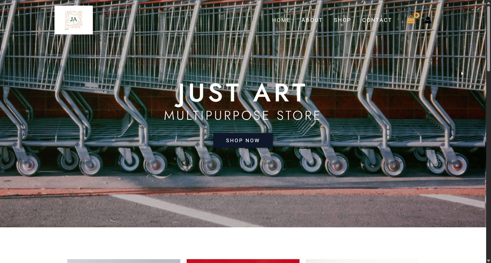
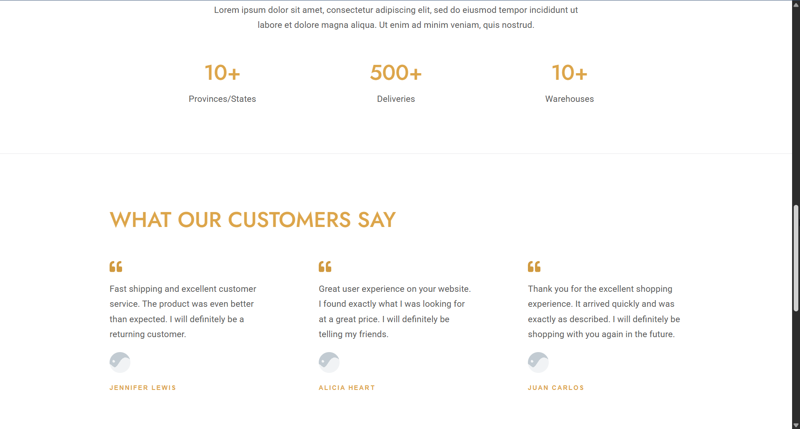
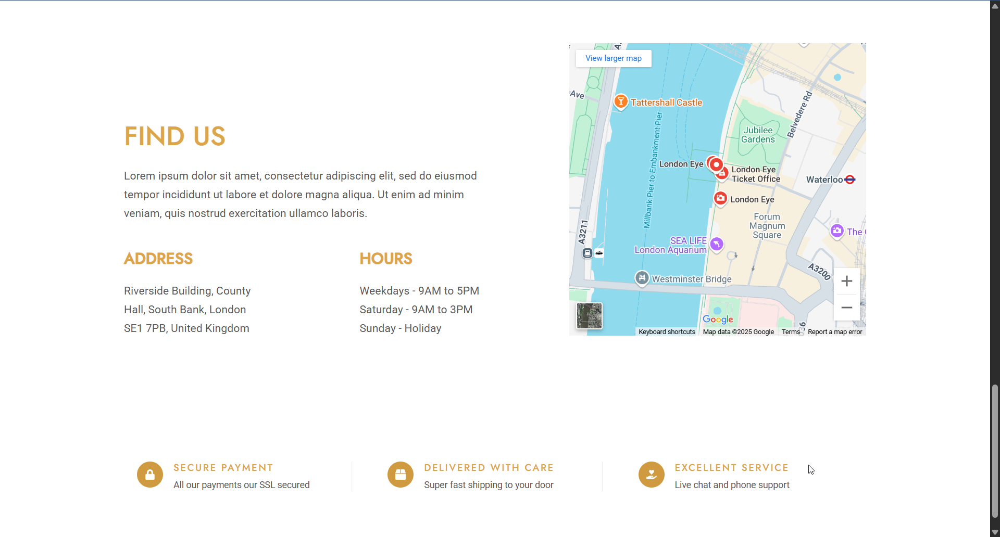
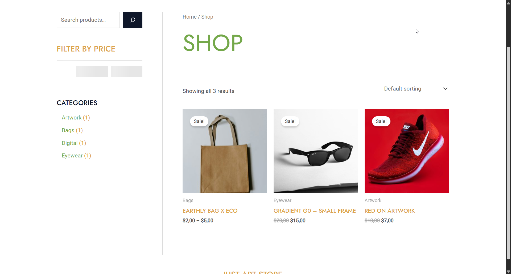
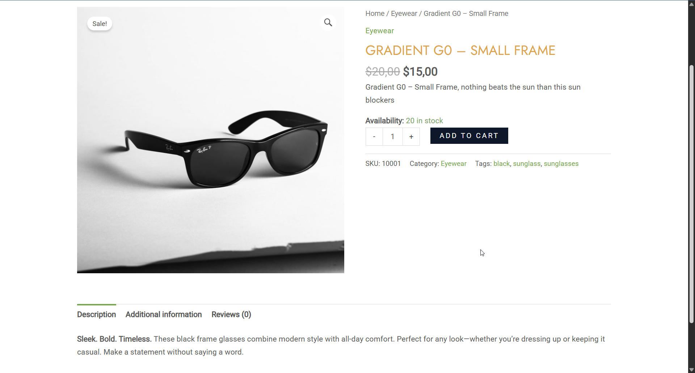
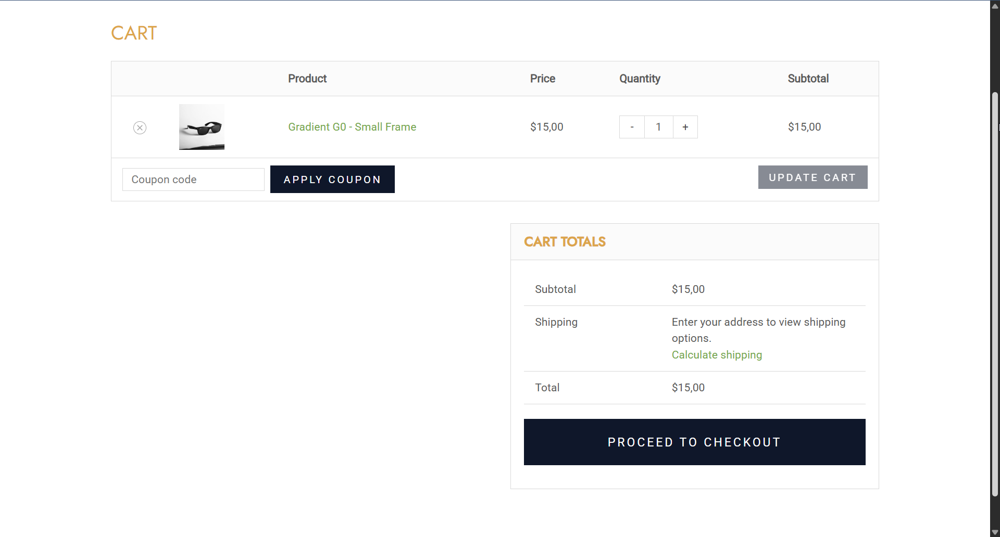
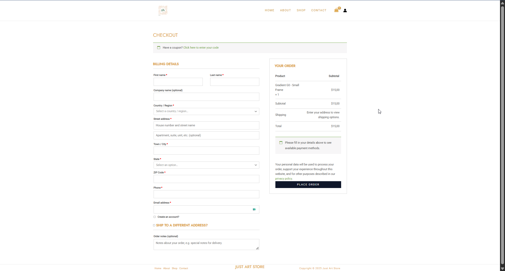

# 🛒 WooCommerce (Just Art Store)

🔗 **Live Demo**: [https://just-art.ct.ws/wordpress/](https://just-art.ct.ws/wordpress/)

## 📌 Project Description

This is a **demo e-commerce store** created using **WooCommerce** on **WordPress**, intended for portfolio showcasing. The project demonstrates a real-world store setup using modern tools and practices.

> ⚠️ Payments are **disabled** in this demo version — this store is for **demo purposes only**.

---

## ⚙️ Technologies Used

- **WordPress** – Content Management System
- **WooCommerce** – E-commerce engine for product, cart, and checkout flows
- **Elementor** – Drag-and-drop page builder
- **Gutenberg Templates** – Block-based layout templates
- **Extra Essentials** - Essential plugins to enhance the security

---

## ✨ Features

- Mobile-responsive and modern UI
- Product listings and individual product pages
- Shopping cart and checkout flow (with payment disabled)
- Uses modular templates for easy scalability and customization

---

## 🖼️ Screenshots

### 🧩 Homepage

### 📄 Product Page

### 🛒 Cart & Checkout

---

## 📦 Repository

This GitHub repository contains only the description and demo link for the project.

> 🚫 The codebase is **not publicly available**.

---

## 📬 Want the Code or the Full Store?

Interested in:

- Accessing the source code?
- Purchasing the full version with payment system integration?
- Customizing the store for your brand?

📩 **Contact me**:  
🌐 Visit Official Site: [https://ethern-myth.vercel.app/](https://ethern-myth.vercel.app/)

---

Thanks for stopping by!
